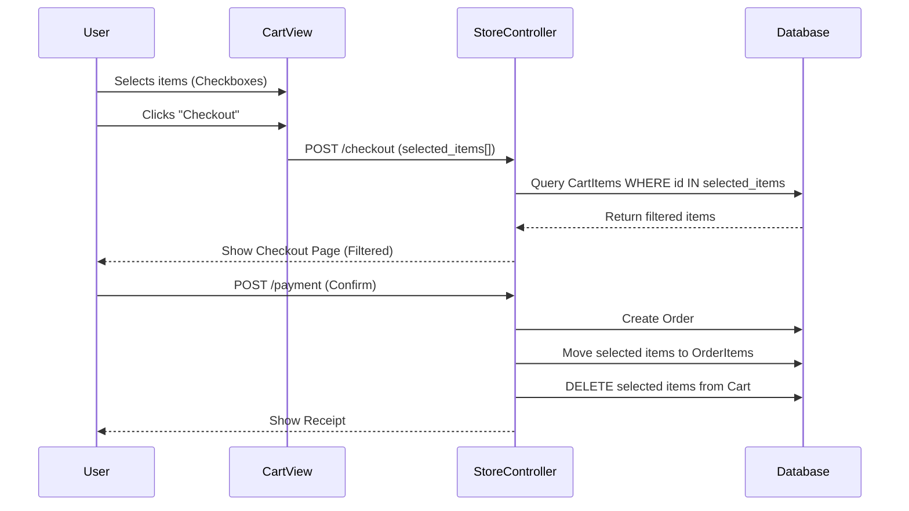

# BuyMyClassmateInc 🎓

An e-commerce platform for buying... classmates? (Just kidding, it's a demo). This project demonstrates a robust Laravel e-commerce architecture with features like partial checkout and role-based access control.

## Features
- **Partial Checkout**: Users can select specific items in their cart to purchase immediately, leaving others for later.
- **Auth Protection**: "Add to Cart" and "Buy Now" actions are strictly limited to logged-in users. Guests are redirected to login.
- **Order Tracking**: Detailed timeline for every order.
- **Admin Panel**: Manage users, products, and order statuses.

## Installation
1.  Clone the repository.
2.  Run `composer install`.
3.  Copy `.env.example` to `.env` and configure SQLite.
4.  Run `php artisan key:generate`.
5.  Run `php artisan migrate:fresh --seed`.
6.  Serve with `php artisan serve`.

## Admin Credentials
- **URL**: `/admin/dashboard`
- **Username**: `admin`
- **Password**: `12345678`

---

# Technical Architecture 🏗️

## 1. Project Structure

```text
BuyMyClassmateInc/
├── app/
│   ├── Http/
│   │   ├── Controllers/
│   │   │   └── StoreController.php    <-- Contains Partial Checkout Logic
│   │   └── Middleware/
│   │       └── IsAdmin.php            <-- Custom Admin Middleware
├── resources/
│   └── views/
│       └── store/
│           ├── cart.blade.php         <-- Cart with Checkboxes
│           └── checkout.blade.php     <-- Filtered Checkout View
└── routes/
    └── web.php                        <-- Route definitions
```

## 2. Deep Dive: Partial Checkout Flow

This is the core feature of this application. Here is exactly how it works, step-by-step.

### Step 1: Selection (Frontend)
In `cart.blade.php`, every item has a checkbox.
```html
<input type="checkbox" name="selected_items[]" value="{{ $item->id }}" class="item-checkbox">
```
We use JavaScript to listen for changes. If no boxes are checked, the "Checkout" button is disabled.
```javascript
// cart.blade.php
function updateCheckoutButton() {
    const count = document.querySelectorAll('.item-checkbox:checked').length;
    document.getElementById('checkout-btn').disabled = count === 0;
}
```

### Step 2: Filtering (Backend)
When the user clicks Checkout, the form submits an array of IDs: `selected_items = [1, 3]`.
In `StoreController@checkout`, we use this array to filter the database query.
```php
public function checkout(Request $request)
{
    $query = CartItem::with('item')->where('user_id', Auth::id());
    
    // CRITICAL: Only get items that were checked
    if ($request->has('selected_items')) {
        $query->whereIn('id', $request->selected_items);
    }

    $cartItems = $query->get();
    // ... render view ...
}
```

### Step 3: Processing (Backend)
When payment is confirmed, we only process the selected items.
```php
public function processPayment(Request $request)
{
    // 1. Create Order
    $order = Order::create([...]);

    // 2. Move ONLY selected items to OrderItems
    // ... (loop through filtered items) ...

    // 3. Delete ONLY selected items from Cart
    if ($request->has('selected_items')) {
        CartItem::where('user_id', Auth::id())
                ->whereIn('id', $request->selected_items)
                ->delete();
    }
    // The unselected items remain in the cart!
}
```

## 3. Sequence Diagram



## 4. Middleware & Security

### Custom Admin Middleware
Unlike the Apple app which uses Gates, this app uses a dedicated Middleware class `IsAdmin`.
```php
// app/Http/Middleware/IsAdmin.php
public function handle(Request $request, Closure $next)
{
    if (!Auth::check() || !Auth::user()->is_admin) {
        abort(403); // Unauthorized
    }
    return $next($request);
}
```
This is registered in `bootstrap/app.php` (or `Kernel.php` in older Laravel) and applied to routes in `web.php`.

### Auth Protection
We strictly enforce login for purchasing actions using Blade directives.
```blade
@auth
    <button onclick="addToCart(...)">Add to Cart</button>
@else
    <a href="{{ route('login') }}" class="btn">Login to Buy</a>
@endauth
```
